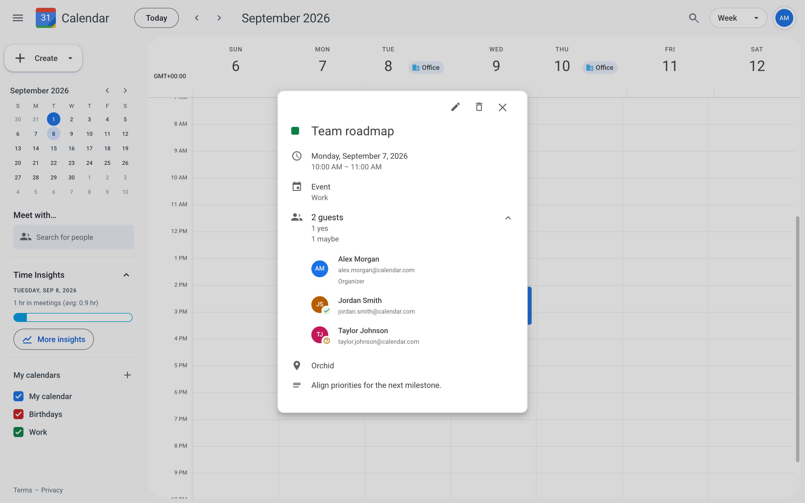
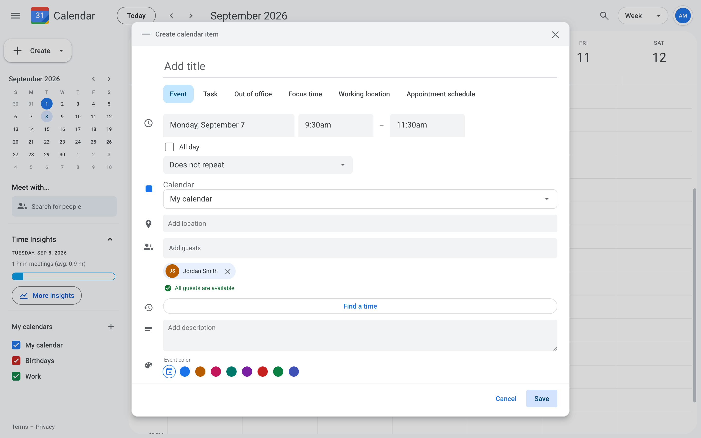
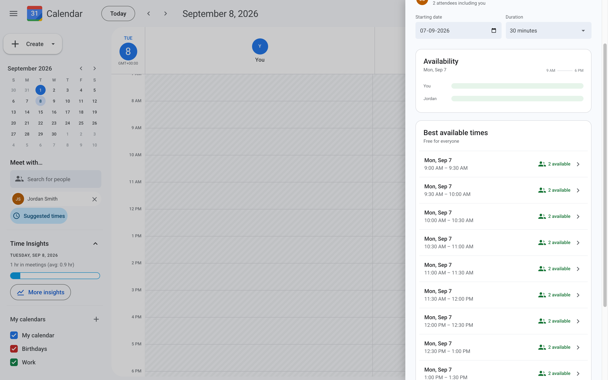
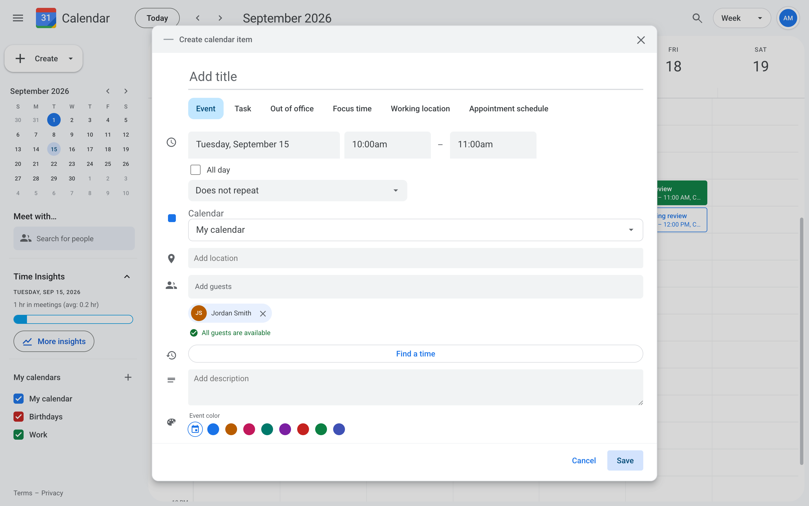
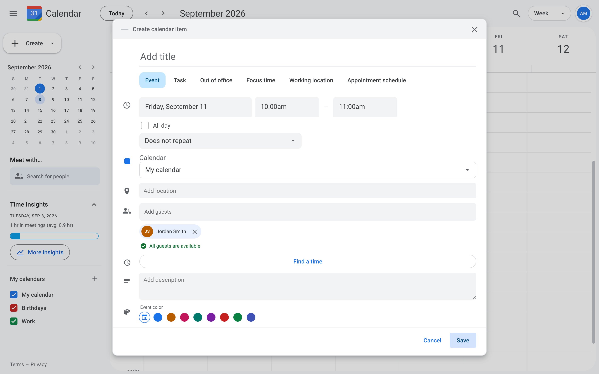

# Bug Fix: Meeting Conflicts

`Medium`

## Overview

**Skills:** Java (Intermediate), Spring Boot, Code Repository
**Recommended Duration:** 60 minutes

This backend development question evaluates date range comparison, recurring event handling, and availability calculation concepts. The task requires fixing bugs that tell an organizer everyone is free when they are not.

Calendar is a scheduling app where a team keeps their calendars and invites each other to meetings. While an organizer picks a time, the event editor checks the guests and warns about anyone who is already busy, and Suggested times offers slots that clash with nobody. However, the availability checks behind both have bugs that prevent them from working correctly.

## Issue Summary

Organizers report that the app keeps telling them everyone is free. A guest who is already sitting in a meeting is shown as available, and so is a guest who is out of office for the whole day. A meeting that repeats every week only blocks the first week, and every week after that looks open. Suggested times offers slots the organizer is already booked in. Your task is to fix these issues on the backend.

## Steps to Reproduce

- Log in using test credentials:
  ```
  Email: alex.morgan@calendar.com
  Password: password123
  ```
- Open the Team roadmap event and expand its guest list. Observe that one guest accepted and the other answered Maybe, so both are busy for that hour.
  
- Click the grid on the same day, half an hour before Team roadmap starts, set the end half an hour after it finishes, then add Jordan Smith. Observe that the editor reports "All guests are available".
  
- Discard that event. Add Jordan Smith under Meet with, click Suggested times, and set the starting date to the day Team roadmap falls on. Observe that the list offers the slots Team roadmap already occupies.
  
- Weekly product planning repeats every Tuesday at 10:00 AM and Jordan Smith accepted it. Go back to last Tuesday, click the grid at 10:00 AM, and add her. Observe that the clash is reported.
  
- Repeat those steps on a Tuesday two weeks ahead. Observe that the meeting still repeats that day, but no clash is reported.
  
- Jordan Smith is out of office all day on the second Friday from today. Create an event on that Friday and add her. Observe that she is reported as available.
  

## Expected Behavior

- A guest should count as busy whenever a meeting genuinely overlaps the proposed time, not only when it starts inside it.
- A guest should count as busy unless they declined, so Maybe and no answer both still block.
- An all-day out of office should make that guest busy for the day, while a working location should leave them free.
- Every occurrence of a repeating meeting should block time, not only the first.
- A reported busy block should be trimmed to the time that was asked about.
- Suggested times should never offer a slot that clashes with the organizer or a guest, or one outside working hours.
